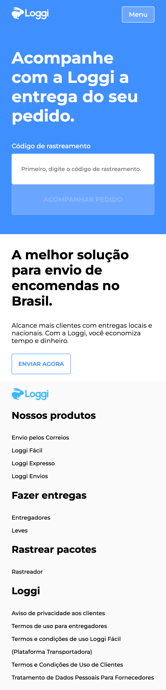
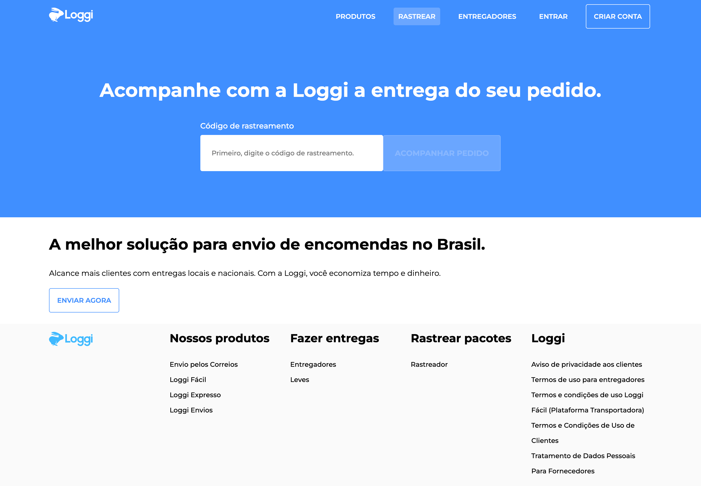
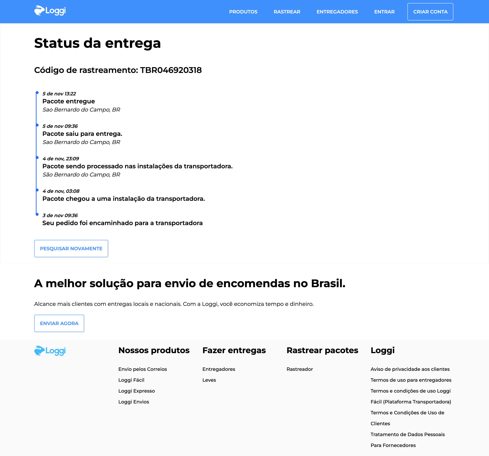

# Jaiminho - Rastreamento de pacotes
Jaiminho é uma aplicação Front-End, para restreio de encomendas através de um código de rastreamento previamente informado ao usuário. 

Para ver a aplicação on-line acesse:
`https://desafio-frontend-psi-ten.vercel.app/`

## Configuração, Instalação e Servindo o projeto localmente

### Pré requisitos
Você precisa ter o [NodeJs](https://nodejs.org) instalado em sua máquina, na versão minima `v18.17.0`. Utilize seu gerenciador de pacotes preferido. 
Eu utilizei o **npm**, e os comandos serão baseados no mesmo.

### Instalando o projeto

#### Clone o projeto
No terminal rode os comandos

```bash 
git clone https://github.com/ubirajarapelli/desafio-frontend.git
```
E acesse o diretório do projeto

```bash
cd desafio-frontend
```

#### Instale as dependencias
No terminal rode o comando

```bash
npm install
```

#### Adicione a variavel de ambiente
Na raiz do projeto adicione o arquivo `.env.local`, com a chave:

```bash
NEXT_PUBLIC_VERCEL_URL="http://localhost:3000"
```

#### Servindo o projeto
No terminal rode o comando

```bash
npm run dev
```

O projeto será servido no endereço `http://localhost:3000/`, agora abra ele no seu browser preferido.

##### Códigos de rastreio
Utilize os códigos de rastreio abaixo para utilizar a aplicação, exite três opções com status das entregas.

+ Entregue: TBR046920318
+ Em transito: TBR813029461
+ Em separaçao TBR318040692

#### Executando os testes unitários
No terminal rode o comando

```bash
npm run test
```

## Decisões de implementação
A aplicação foi escrita utilzando o **Next.Js** juntamente com **Typescript**.

Os testes unitários foram escritos utilzando **Testing Libray** juntamente com **Jest**, fazendo a abordagen de testes de comportamento dos componentes e não os [testes de detalhes da implementação](https://kentcdodds.com/blog/testing-implementation-details) e seguindo o padrão Triple A(Arrange, Act, Assert).

Optei na estilização escrever **CSS** juntamente com a metodogia **BEM** e não utilizar o **Material UI**, pois acredito que para a interface idealizada por mim consegui simplificar o markup e tamém manter a semantica mantendo a separação das camadas, onde com a utilização do Material UI eu levaria mais tempo para chegar no resultado.

### Organização de pastas e arquivos
Com a utilização do NextJs, segui a estrutura de pastas sugerida pela documentação onde detro da pasta **src/** temos:

**app/**: Ficam as páginas, na raiz o arquivo *layout* e *pages* (Home) e seu respectivo teste e estilização, seguindo a convenção do Next. 

**app/api/progressTracking/[code]**: Fica a next API Route, no arquivo *route* onde o metodo GET é utilizado, buscando em um mock no formato `json` com a lista de status do rastreamento do pedido. 

**app/rastrear/[code]**: Fica a pagina que apresenta o resultado da busca pelo código de rastreamento, com seu respectivo teste e estilização.

**assets**: Ficam os arquivos de imagens, os dois `svg` utilizados no projeto.

**components**: Ficam os componentes que podem ser reutilizados
+ AttainNewCustomers: Call To Action para a utilização do serviço.
+ Button: Botão com variações *small* e *large*.
+ Footer: Apenas para reutilização visual com links.
+ Header: Contém lógica para abrir/fechar o menu mobile e apresentar/esconder o botão conforme a responsividade.
+ Input: Contém o `label` + `input` juntos para manter a semântica quando renderizado.
+ LinkButton: Estendido do `next/Link` e com a estilização em formato de botão
+ Menu: Menu único e estilizado conforme a responsividade.
+ TrackList: Lista cada etapa da entrega do pacote com data/hora, status e localidade.
+ Typograpty: Utilizado para textos, com a variante de titulos H1, H2, H3 e por padrão ele renderiza um P

**data**: Onde está armazenado o mock para a API no formato `json` e um `ts` utilizados nos testes.

**styles**: Ficam os arquivos de estilização `global` e `variables` que são utilizados em todas as páginas do projeto através do layout. 

### Decisão visual e experiência de navegação
Busquei seguir um layout simples com Header e Menu seguindo do conteúdo principal com o formulário para entrar com o código de rastreamento e/ou apresentação do status do rastreamento seguido de um call to action para a utilização do serviço de entrega e Footer.

Segui a tipografia e paleta de cores com variações de azul, branco, preto e tons de cinza utilizados pela Loggi, com feedbacks visuais nos links do header em formatos de botões e transição para entrada do menu mobile.

Na página Home, o formulário inicia com o botão desabilitado e somente após a digitação do código de rastreamento validado por uma expressão regular que o botão é habilitado para a verificação, e após o click acontece a navegação para a página de navagação.

Na página Rastrear (Tracking) faz a busca na API pelo código digitado, e apresenta o status da entrega do pacote com data/hora, status e localidade. Caso o código seja inválido é apresentada a mensagem **Nenhum pedido encontrado para esse código.**. A contém um Link para retornar a tela inicial e iniciar uma nova consulta.

#### Screemshots

##### Mobile
Home Page | Rastrear
--------- | --------
 | 


##### Desktop
**Home**


**Rastrear**

