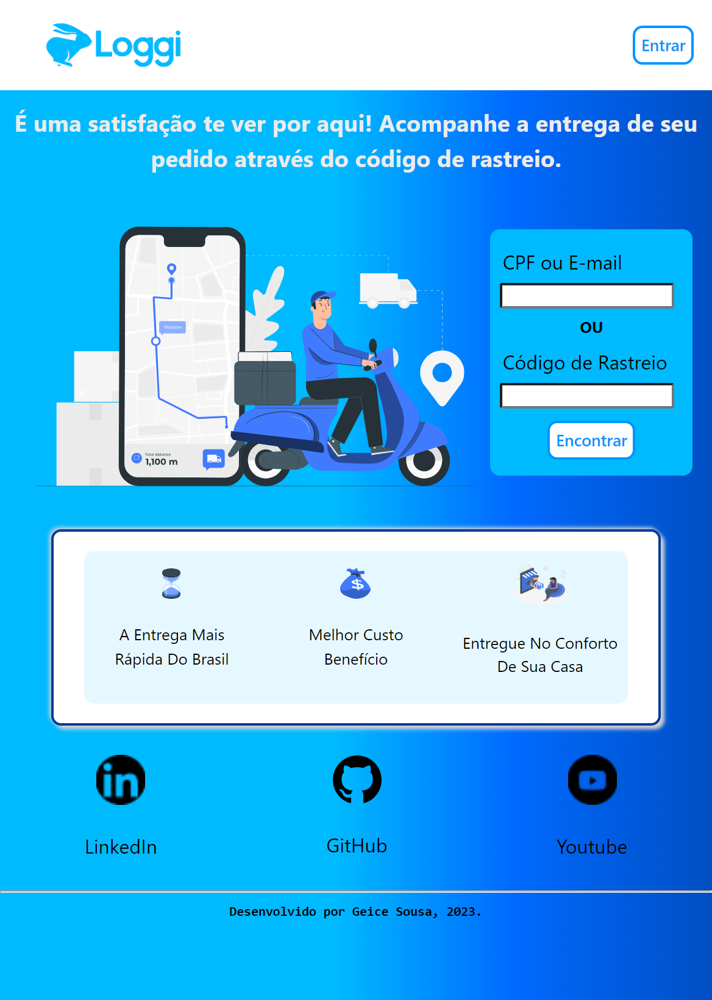
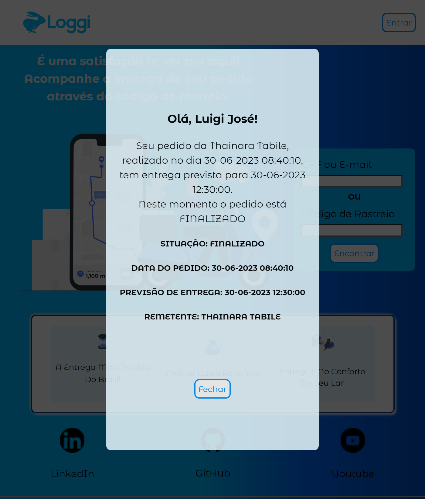

# **_"Uma nova interface para o rastreador de pacotes da Loggi"_**

#### Fazer compras online e envios de pacotes e encomendas esta cada vez mais no nosso cotidiano; precisamos acompanhar o caminho de nosso pedido/pacote e a melhor forma de fazer isso é através do rastreamento. Aqui você consegue localizar o seu pacote de maneira rápida e prática e acompanhar cada mudança de seu pedido.


## Instruções técnicas para testar localmente

- Faça um `fork` .png>)

- Faça um `clone` .png>) 

- Digite no terminal da IDE de sua preferência:
```
1) npm install || npm i
2) npm run dev
3) abra o link no seu navegador preferido
```

## Informações para testar o funcionamento e funcinalidades do rastreador:
  -  Digite o número 1 ou 2 ou 3 no campo 'CPF ou E-mail' ou no campo 'Código de rastreio' e clique no botão 'Encontrar'.


## Para [visualizar a aplicação online](https://loggi-desafio-frontend.vercel.app/) ⬅️🖱️

## Protótipos de alta fidelidade
.png)


## Imagens da página deployada

.png)





##### Obrigada! 