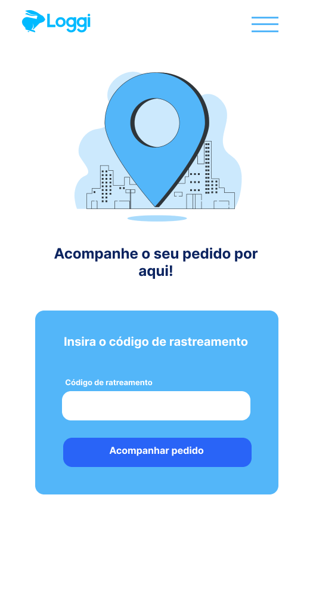
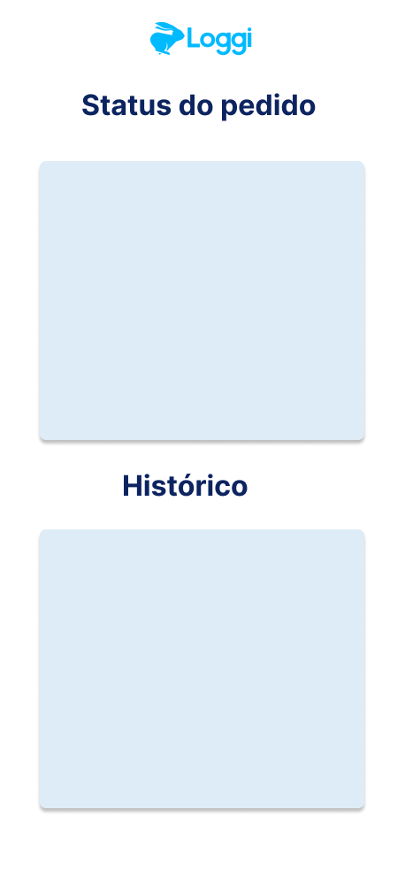
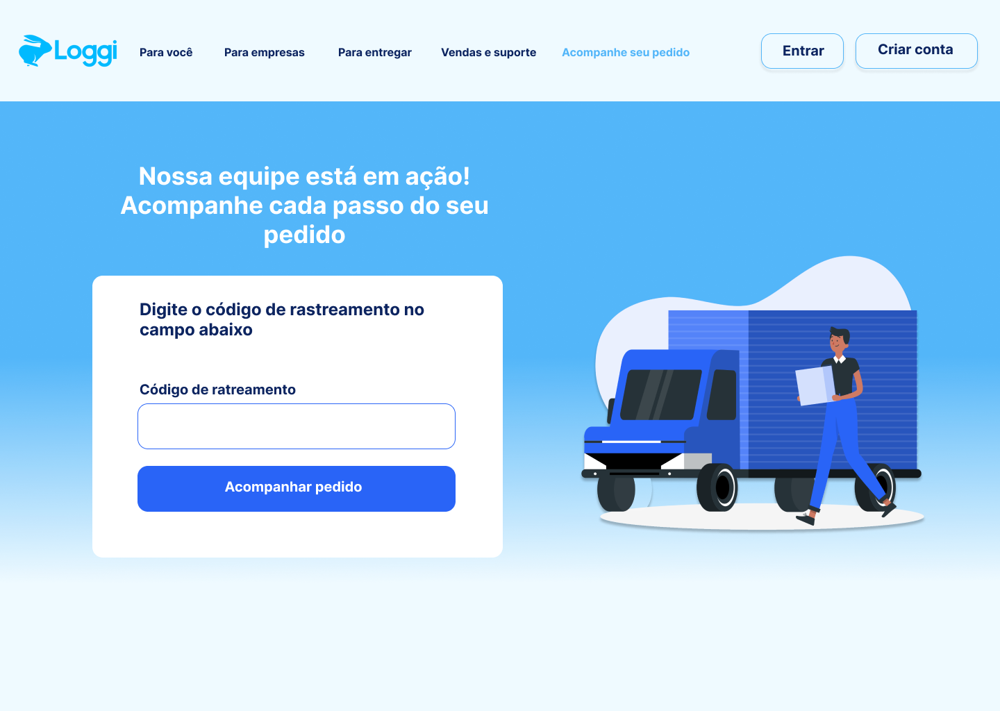
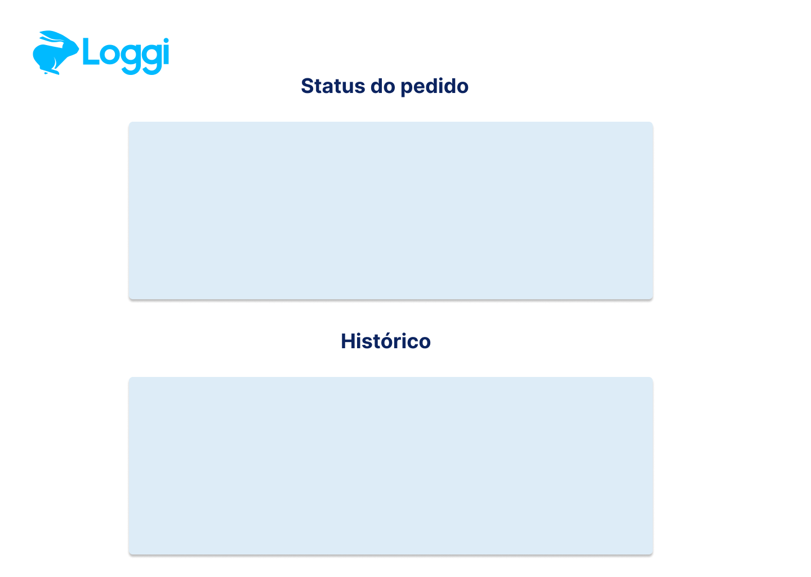
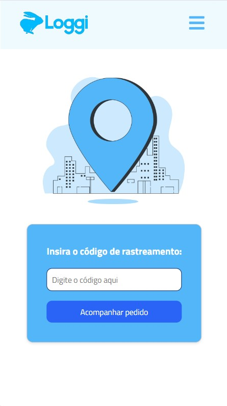
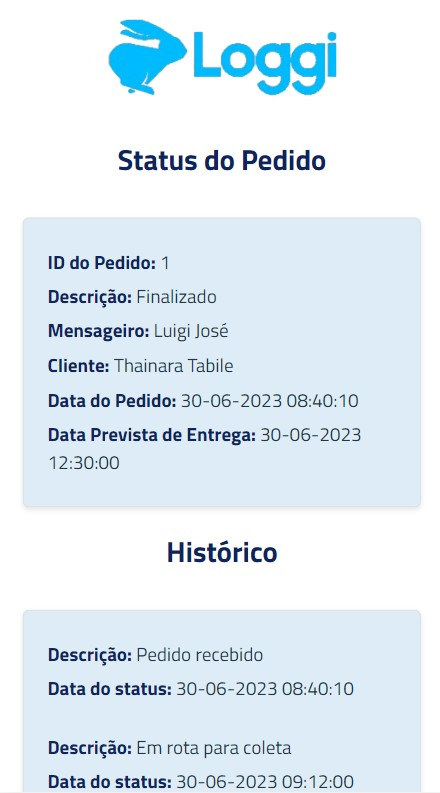
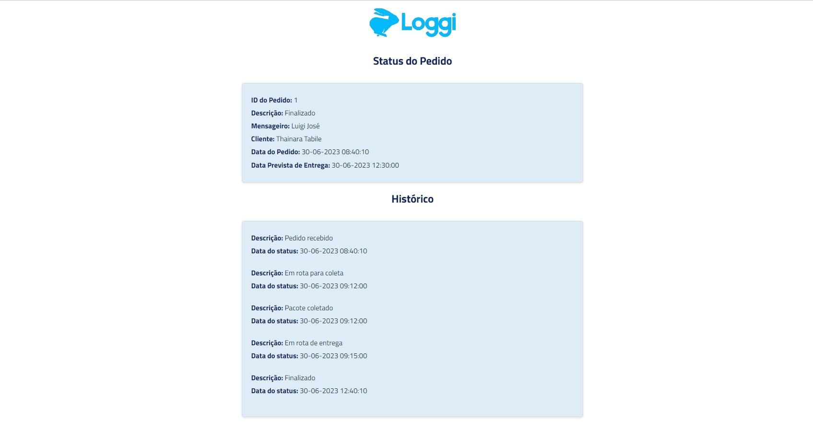

## Talent Fest Brasil 2023 - Desafio Loggi

O Talent Fest é um evento de programação proporcionado pela [Laboratória](https://www.laboratoria.la/br), onde as formandas do bootcamp recebem um desafio de alguma das empresas participantes e precisam concluí-lo em 3 dias. 

## O desafio

O desafio proposto pela empresa [Loggi](https://www.loggi.com/) era recriar sua página de rastreio de produtos, com liberdade criativa par definir como seria a interface e a experiÊncia do usuário.

## Considerações Técnicas

* React para a construção do site
* Mock de API para a conexão com o backend, permitindo consumir os dados dos pedidos
* Figma para os protótipos
* Git para o versionamento de código e conexão com GitHub
* Trello para planejamento e organização

## Instruções de uso

1. Acesse o projeto aqui pedidos [aqui](https://desafio-loggi-bruna.vercel.app/).

2. Insira o código do pedido no campo de rastreamento para ver o status de cada um.

    | Pedido       | Código |
    |--------------|:----:|
    | Pedido 1 | 1 |
    | Pedido 2 | 2 |
    | Pedido 3 | 3 |

3. Clique no botão `Acompanhar pedido` para visualizar o status do pedido.

4. Você será redirecionado para uma página com os status e o histórico do pedido.

Você também pode fazer o fork do projeto para o seu GitHub, clonar o repositório e rodar os seguintes comandos do seu terminal: `npm install` e `npm run dev` para acessar a aplicação.

## Histórias de Usuários

**História do usuário 1:** “Como usuário, quero poder rastreat o meu pedido”.

* Criar uma página inicial para a aplicação de rastreamento de produtos.

* Adicionar um campo de entrada de texto onde o usuário pode inserir o código de rastreamento do produto.

* Implementar um botão rastreamento, que inicia a busca pelo produto com base no código inserido.

* Conectar a página ao backend para buscar as informações do produto com base no código fornecido.

* Exibir as informações do produto na página, como status de entrega, localização atual e data estimada de entrega.

**História do usuário 2:** “Como usuário, quero acessar o site pelo meu celular”.

* Criar o protótipo mobile.

* Começar a criação do site pelo método mobile first.

**História do usuário 3:** “Como usuário, quero acessar o site pelo meu computador”

* Criar o protótipo para desktop;

* Ajustar a resposividade para telas maiores utilizando 'media query'.

**História do usuário 4:** “Como daltônica quero poder navegar pelo site sem dificuldades”.

* Utilizar a extensão 'Colorblindly'.

## Protótipos

  
Página de rastreio (mobile)

 
  

  
Página de status do pedido (mobile)

 
  

  
Página de rastreio (desktop)

 
  

  
Página de status do pedido (desktop)

 
  

## Resultado

  
Página de rastreio (mobile)

 
  

  
Página de status dos pedidos (mobile)

 
  

  
Página de rastreio (desktop)

 
  

  
Página de status dos pedidos (desktop)

 
  

## Desenvolvedora

Bruna Abreu - [ Linkedin](https://www.linkedin.com/in/bru-abreu/)