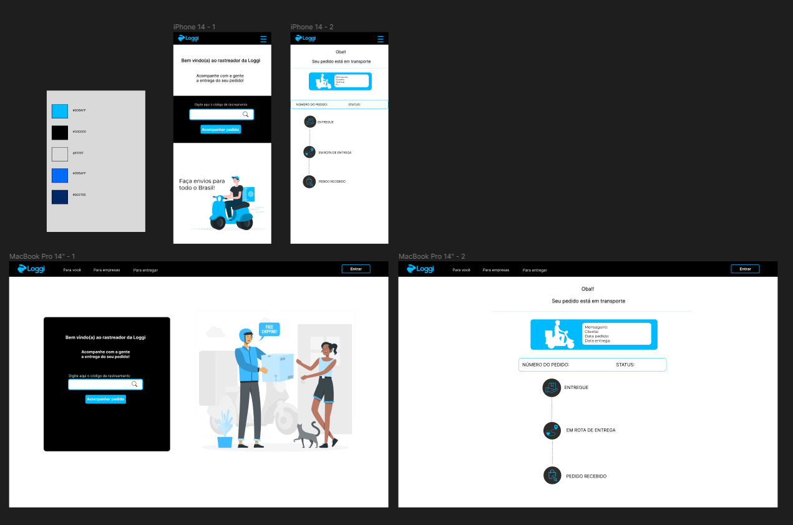

## Interface de rastreio Loggi

 ## ⭐️ Resumo do projeto
 Este projeto foi desenvolvido no Talent Fest da Laboratoria em parceria com a Loggi. O objetivo principal era criar uma interface amigável e intuitiva para que os usuários pudessem inserir o número do seu pedido e, assim, acessar as informações de rastreamento e o status atualizado do seu pedido.

 ## 🎨 Protótipo
Antes de iniciar o desenvolvimento completo do projeto, foi criado um protótipo no Figma para visualizar a interação do usuário na tela e a disposição dos elementos de forma mais precisa.

## 📝 Descrição do projeto
O projeto foi desenvolvido utilizando a biblioteca React e estilizada com a ajuda do Material UI. A aplicação possui uma interface composta por duas telas principais.

Tela principal:
nessa tela o usuário tem a possibilidade de inserir o número do seu pedido em um campo específico. Após inserir o número, e clicar no botão "Acompanhar o pedido", o usuário é redirecionado automaticamente para a página de rastreamento, onde encontrará detalhes fundamentais sobre o andamento de sua encomenda.

Página de rastreamento:
Ao clicar no botão da tela principal, o usuário é redirecionado para a página de rastreamento. Nela, é possível visualizar o status atual do pedido, quem está levando sua encomenda, a previsão de chegada e também a rota que está sendo seguida para a entrega do produto.

API mock:
Para garantir a eficácia e a realidade na representação da rota, foi desenvolvido uma API fake especialmente criada para esse fim. Essa API é responsável por fornecer dados fictícios como por exemplo de localização e status do pedido, criando uma experiência realista para o usuário.

## 🚚 Simulando um rastreio

Para simular um rastreio do pedido basta [acessar a aplicação](https://desafio-frontend-loggi.vercel.app/) e digitar o número do pedido (1, 2, 3) no campo "Código de rastreamento", e ao clicar em "Acompanhar o pedido" você é redirecionado para a página de rastreio.

| Pedido                    | Digite |
|------------------------------|:----:|
| Acesso ao rastreio do pedido 1 | 1 |
| Acesso ao rastreio do pedido 2 | 2 |
| Acesso ao rastreio do pedido 3 | 3 |

## 👩‍💻 Desenvolvedora
Giselle Schwab Silva  [Linkedin](https://www.linkedin.com/in/giselle-schwab-silva-58930610a/)
