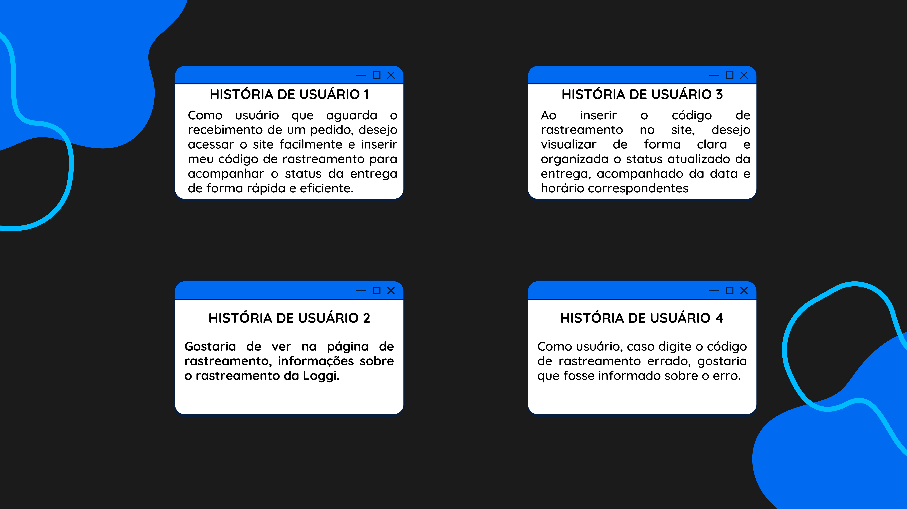
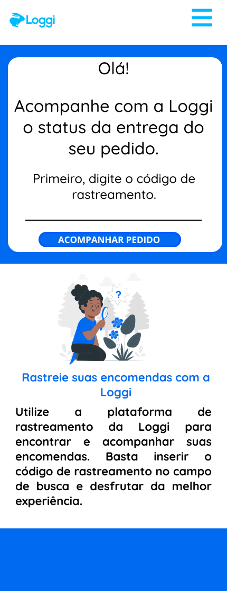
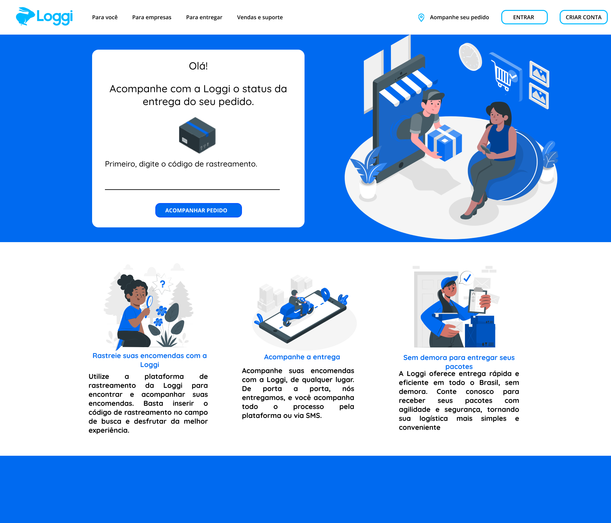
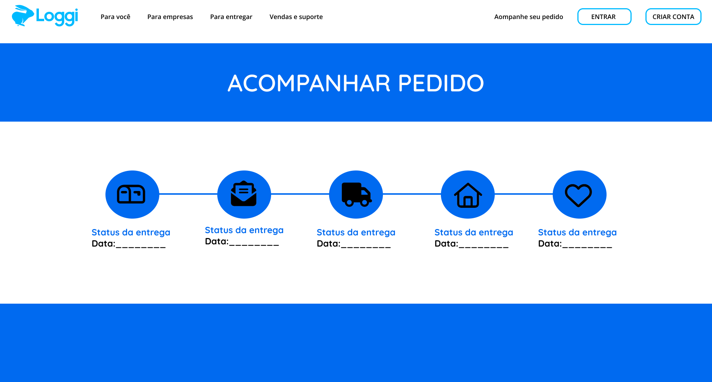

 **Status do Projeto:** _Concluído_ 
 
 

 ## Índice

- [Índice](#índice)
  - [1. Resumo do Projeto 🎯](#1-resumo-do-projeto-)
  - [2. Instruções 📖](#2-instruções-)
  - [3. Histórias de Usuário 📚](#3-histórias-de-usuário-)
  - [4. Protótipos 🎨](#4-protótipos-)
    - [Versão Mobile 📱](#versão-mobile-)
    - [Versão Desktop 💻 - Tela inicial de rastreio](#versão-desktop----tela-inicial-de-rastreio)
    - [Versão Desktop 💻 - Tela de informações de rastreio](#versão-desktop----tela-de-informações-de-rastreio)
  - [5. Decisões Estratégicas ⚙️📈](#5-decisões-estratégicas-️)
  - [6. Implementações Futuras ⏱️](#6-implementações-futuras-️)
  - [7. Ferramentas Utilizadas 🔧](#7-ferramentas-utilizadas-)
 
  
***

 ### 1. Resumo do Projeto 🎯
No Talent Fest 2023 da Laboratoria, foi desenvolvido um projeto para a empresa Loggi, apresentando uma página de rastreamento de encomendas. Essa plataforma permite que os usuários rastreiem seus pacotes de forma eficiente, mantendo-os informados sobre o status de entrega em tempo real.

 ### 2. Instruções 📖

 Para acessar a aplicação, você pode acessá-la clicando [aqui](https://desafio-frontend-xi.vercel.app/). Utilize os seguintes códigos de rastreamento simulando uma compra para acompanhar o status das encomendas:

 

 🔑: **123456**
 🔑: **678910**
 🔑: **111213**
 🔑: **141516**

 
 

 ### 3. Histórias de Usuário 📚
 

 
 ### 4. Protótipos 🎨

 #### Versão Mobile 📱
 

  #### Versão Desktop 💻 - Tela inicial de rastreio
 

   #### Versão Desktop 💻 - Tela de informações de rastreio

 ### 5. Decisões Estratégicas ⚙️📈
 Ao receber o projeto, a primeira decisão foi estudar `NextJS` e o `Material UI`, ferramentas recomendadas pelos colaboradores da Loggi. Porém, devido ao prazo apertado e às dificuldades que encontrei ao tentar utilizá-las, percebi que seria mais sensato recomeçar o projeto, desta vez optando por utilizar `React`, uma escolha mais familiar que me permitiria avançar com maior agilidade.

 Após essa mudança, iniciei minha análise do site da Loggi e de outras empresas que trabalham com rastreamento, buscando insights para o desenvolvimento dos protótipos. Durante essa avaliação, identifiquei algumas deficiências na versão mobile do site. A ausência do `header` e do `footer`, juntamente com a falta de informações sobre a própria Loggi, criavam uma oportunidade para melhorar a experiência do usuário. Acreditei que, ao acessar o site apenas para rastrear uma encomenda, os usuários poderiam ser apresentados à Loggi de forma mais estratégica.

 Além disso, percebi que a `estilização` do site, principalmente na versão `mobile`, precisava de aprimoramentos para torná-la mais sofisticada e cativante. Essa percepção me motivou a criar protótipos que atendessem às expectativas dos usuários em termos de design e usabilidade.

 No decorrer do projeto, considerei a restrição de tempo e, como uma solução prática, escolhi utilizar um `arquivo JSON` inserido diretamente no próprio projeto para viabilizar a interação do usuário ao buscar um código de rastreamento.

 Em conclusão, o projeto foi uma jornada de aprendizado e adaptação, onde a flexibilidade para mudar de direção permitiu que eu entregasse um produto funcional e de qualidade dentro do prazo estipulado.

 ### 6. Implementações Futuras ⏱️
Reconheço que existem oportunidades para aprimorar ainda mais a aplicação e proporcionar uma experiência excelente aos usuários. Abaixo estão algumas das perspectivas futuras que considero fundamentais:

- **Interatividade do Menu Hamburguer e Ícones no Footer:** Tornar o menu hamburguer e os ícones no footer interativos, permitindo que os usuários cliquem neles para acessar informações adicionais e navegar facilmente pelo site.

- **Pesquisa de Usabilidade com Usuários:** Realizar testes e pesquisas com usuários reais para compreender suas necessidades e preferências, identificando oportunidades de melhorias para uma experiência mais intuitiva.

- **Testes Unitários para Estabilidade:** Implementar testes unitários para garantir a eficácia das funcionalidades da interface, detectando e corrigindo problemas de forma ágil e mantendo a estabilidade geral do projeto.

 ### 7. Ferramentas Utilizadas 🔧

 

  
  
  
  
   
  
  

  

