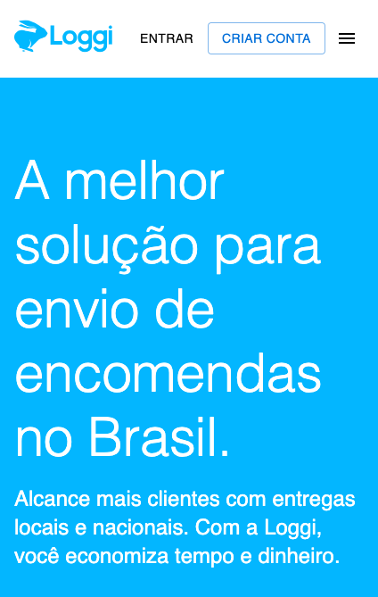
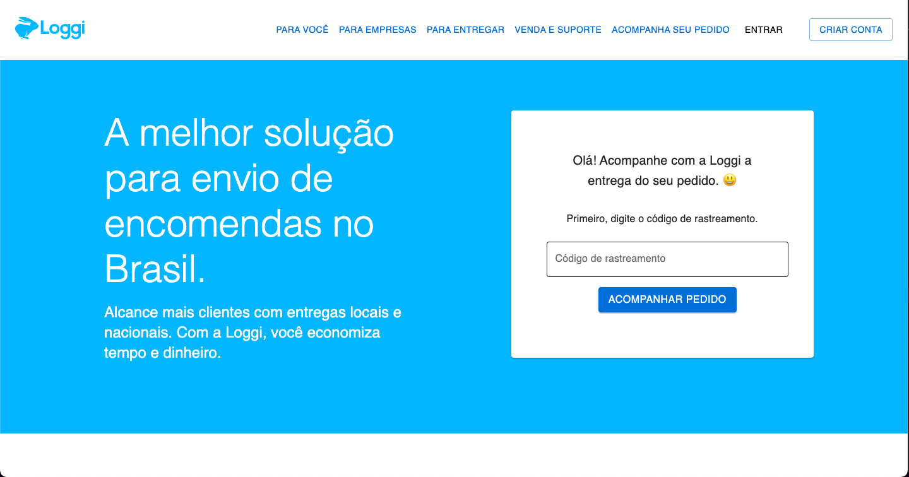

# **Desafio - Rastreador de Pacotes**

Demo: [link para hospedagem vercel](https://desafio-frontend-focvnnc3s-alalbux.vercel.app/)

## **Descrição**

Este repositório apresenta a aplicação resultante de um desafio, que inicialmente tinha como objetivo redesenhar a tela de rastreamento de pacotes.

<br />

Versão móvel:


<br />
<br />

Versão desktop:



<br />
<br />

## **Desenvolvimento**

### Pré-requisitos

Certifique-se de ter o Docker instalado no seu sistema. Você também deve ter o Node.js e o npm instalados se desejar executar o projeto localmente sem o Docker.

- [Docker](https://docs.docker.com/get-docker/)
- [Node.js e npm](https://nodejs.org/en)

Este é um projeto Next.js que utiliza o Docker para facilitar o gerenciamento do ambiente de desenvolvimento. O Docker é uma tecnologia de contêiner que permite empacotar e distribuir aplicativos com todas as suas dependências.

<br />

### **Instalação**

Para instalar o Rastreador de Pacotes, siga estas etapas:

1. Clone o repositório para o seu ambiente de desenvolvimento:

```bash
git clone https://github.com/alalbux/desafio-frontend.git

```

1. Navegue até o diretório do projeto:

```bash
cd docs/package-tracker

```

1. Instale as dependências e inicie o ambiente de desenvolvimento:

```bash
npm install
npm run dev

```

<br />

## **Build**

```bash
make build

```

Usando o docker:

```bash
make test

```

<br />

## **Testes**

### **Testes Unitários**

Execute testes unitários:

```bash
npm run test

```

Usando o docker:

```bash
make test

```

Execute relatório de cobertura de testes:

```bash
npm run test:coverage

```

<br />

### **Testes de Integração (E2E)**

Execute testes usando Cypress:

```bash
npm run test:run

```

Abra o Cypress no navegador:

```bash
npm run test:e2e

```

<br />

## **Monitoramento**

### **Lighthouse**

Monitore o SEO localmente:

```bash
npm run lighthouse

```

<br />

## **Comandos Docker**

O arquivo **`Makefile`** contém comandos para gerenciar o Docker no projeto. Abaixo estão alguns comandos Docker comuns:

- **`make build`**: Compila a imagem Docker para o projeto.
- **`make run`**: Inicia o contêiner Docker com a imagem compilada.
- **`make stop`**: Para e remove o contêiner Docker em execução.
- **`make clean`**: Para o contêiner e remove a imagem Docker.
- **`make dev`**: Inicia o servidor de desenvolvimento dentro do contêiner Docker.
- **`make exec CMD="<comando>"`**: Executa um comando personalizado dentro do contêiner em execução.

<br />

### Exemplo de uso dos comandos Docker:

Compilar a imagem Docker:

```
make build
```

Iniciar o contêiner Docker:

```
make run
```

Parar e remover o contêiner Docker:

```
make stop
```

Remover a imagem Docker:

```
make clean
```

## **Estrutura do Projeto**

- **`app/`**: Diretório onde você cria as páginas da sua aplicação Next.js. Os arquivos JavaScript neste diretório se tornam rotas acessíveis no seu aplicativo.
- **`public/`**: Diretório para arquivos públicos, como imagens, fontes e outros recursos estáticos. Os arquivos aqui são acessíveis diretamente pelo navegador.
- **`components/`**: Diretório onde você coloca componentes reutilizáveis que podem ser usados em várias partes do seu aplicativo.
- **`styles/`**: Diretório para arquivos de estilos globais ou compartilhados.
- **`locales/`**: Diretório para arquivos de variáveis de listas fixas que podem ser usados para adicionar chaves i18n.

## **Sobre o Desenvolvimento**

Gostaria de expressar minha gratidão por ter a oportunidade de participar do processo seletivo. O desafio foi uma experiência desafiadora e enriquecedora.

Iniciei o desenvolvimento usando o template fornecido no projeto. Inicialmente, enfrentei algumas dificuldades devido à minha falta de familiaridade com a biblioteca de componentes do material ui, o que acabou resultando em um tempo de desenvolvimento um pouco mais longo do que o planejado. Normalmente acabo trabalhando mais com componentes customizado. Reconheço que não consegui atingir o padrão de estilo desejado para o projeto.

Ao trabalhar no design, optei por criar um visual mais limpo, aderindo à paleta de cores branca e azul da Loggi. Além disso, projetei a caixa de pesquisa de código de rastreamento na lateral direita da tela para melhorar a usabilidade. Essa decisão é para dar mais destaque ao campo de busca, tornando a mensagem da caixa de pesquisa mais visível. Embora tenha tentado aplicar design tokens, não consegui manter a consistência ao longo do projeto, principalmente em termos de espaçamento, tamanho de fonte/estilos de tipografia e cores.

No menu, optei por criar alguns componentes para compor o **`Header`** para uma melhor separação de dependências. Acredito que teria sido melhor se eu tivesse separado ainda mais as dependências, pois o **`Navigation`** ficou complexo demais. Talvez devesse tê-lo dividido em outros componentes.

Arrependo-me de não ter mantido os componentes aninhados em pastas dentro do componente principal. Acredito que isso teria preservado melhor a hierarquia das pastas.

Quanto aos testes unitários, escolhi usar a biblioteca de testes **`testing-library`** e o **`Jest`**. No entanto, devido à minha falta de familiaridade com a biblioteca de UI Kit, não consegui seguir a abordagem TDD (Desenvolvimento Orientado por Testes) e criei apenas testes unitários de renderização de snapshots.

Houve diversas áreas em que eu gostaria de ter entregue um resultado mais completo no desafio. Algumas das áreas em que planejei trabalhar, mas que requeriam mais tempo do que estava disponível, incluem:

- **`Monitoramento`**: Implementar uma biblioteca de rastreamento ou captura de erros, como o Sentry, para melhorar a detecção e resolução de problemas.
- **`Testes Unitários`**: Aplicar o padrão AAA (Arranjar, Agir, Assertir) em testes unitários para garantir uma cobertura de código mais abrangente.
- **`Testes de Integração (E2E)`**: Aprimorar os testes de integração na rota **`/`** e detalhar melhor o arquivo **`app.cy.js`**.
- **`API`**: Adicionar endpoints GET para obter informações sobre uma entrega específica após a pesquisa de código e para obter uma lista dinâmica para o menu superior e seus submenus.
- **`Internacionalização (i18n)`**: Implementar variáveis de conteúdo para facilitar a internacionalização futura.
- **`utils`**: Criar uma pasta de utilitários com funções para gerar SVG. Acredito que poderia ter organizado melhor as dependências.
- **`SEO`**: Adicionar o Lighthouse a futuras páginas, pois ele traz melhorias de desempenho.

Embora sinta que ainda há espaço para melhorias, estou satisfeito com o resultado do desafio. Agradeço pela oportunidade e aguardo ansiosamente os feedbacks.
